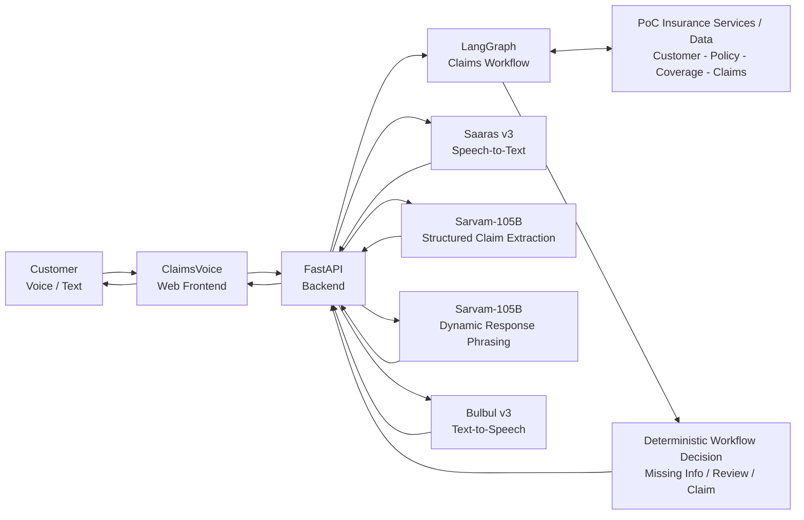
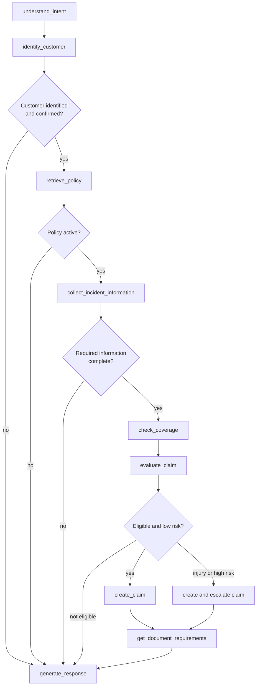

# ClaimsVoice

ClaimsVoice is a Sarvam AI-powered multilingual voice assistant that helps insurance customers register motor claims through a guided conversational experience.

## 1. Overview

ClaimsVoice is a proof of concept for the Sarvam AI Pre-Sales Engineer assignment. It demonstrates a Hindi/Hinglish-first insurance First Notice of Loss (FNOL) journey where a customer can speak or type accident details, identify themselves by mobile number, verify policy eligibility, capture incident information, create a mock claim, receive document requirements, and hear the assistant response through generated speech.

The project is intentionally built as an MVP. It uses fictional local customer, policy, and claim data so the full demo can run on a laptop without connecting to a real insurer system.

## Demo

ClaimsVoice currently runs as a local Proof of Concept. Follow the Setup Instructions below to run the application locally.

## 2. Key Capabilities

- Browser-based customer experience with microphone input and text fallback.
- Hindi/Hinglish and English customer response handling.
- Customer lookup by registered mobile number.
- Customer identity confirmation before policy details are shown.
- Policy lookup, vehicle lookup, policy status check, and deterministic coverage check.
- Guided incident information collection for date, time, location, incident type, damage, third-party involvement, injury status, and driveability.
- Missing-information handling that asks for only the next required detail.
- Deterministic eligibility rules for active policy, covered incident type, complete information, and injury/high-risk escalation.
- Deterministic extraction safety net for common Hindi/Hinglish and English claim facts when the live model extraction is unavailable or inconsistent.
- Claim creation into the local JSON-backed mock claim store.
- Document requirement generation based on the persisted claim details.
- Human review flow for injury or high-risk scenarios.
- Live captured-information summary and final claim/review summary in the UI, with localized display values that do not mutate persisted claim facts.
- Sarvam-105B dynamic response phrasing for acknowledgements, clarifications, and next-step questions, constrained by deterministic workflow state.
- Deterministic identity confirmation and security-sensitive response wording before any policy details are shown.
- Bulbul-generated audio playback for assistant responses when Sarvam TTS succeeds.
- Structured voice diagnostics for browser recording, no-speech, and Saaras transcription failures.

## Sarvam APIs Used

The current implementation uses the Sarvam Python SDK through `app/sarvam.py`.

| Sarvam Capability | Model | Role in ClaimsVoice |
| --- | --- | --- |
| Speech-to-Text | `saaras:v3` | Converts browser microphone audio into text using `speech_to_text.transcribe`. The integration uses code-mixed mode and lets Sarvam detect the language. |
| Language Model | `sarvam-105b` | Extracts structured FNOL claim information from customer text using a strict JSON schema, then generates concise customer-facing response phrasing from a constrained workflow context. |
| Text-to-Speech | `bulbul:v3` | Converts the exact assistant response shown in the UI into MP3 audio for browser playback. |

Important implementation note: Sarvam-105B is used for two separate tasks. First, it extracts structured claim facts. Second, after LangGraph and deterministic rules decide the allowed workflow action, it phrases the customer-facing reply using the latest customer message, current ClaimState, extracted facts, missing information, and deterministic fallback response. The LLM does not decide policy validity, coverage, claim creation, or escalation. Deterministic extraction is used as a safety net for obvious claim facts if live extraction is unavailable or inconsistent. Deterministic response templates remain available as a fallback if dynamic response generation is unavailable, and identity/security checkpoint messages are kept deterministic.

The Sarvam SDK client is created with an internal HTTPX client that does not trust inherited proxy environment variables. This keeps local demo calls from failing when the shell has stale or broken proxy settings.

Generated audio files are stored under `static/generated/audio/` and served through `/media/audio/...`. The folder is ignored by Git.

## Architecture Overview

ClaimsVoice is a Proof of Concept. Customer, policy, coverage, and claim data used in the current implementation is simulated for demonstration purposes. Production deployment would require integration with the insurer's customer, policy administration, claims management, document management, security, and operational platforms.

ClaimsVoice Web Frontend:

- Provides the browser conversation interface.
- Supports microphone input through the browser `MediaRecorder` API.
- Supports typed text input as a fallback.
- Includes Hindi/English language selection.
- Shows claim progress, captured information, final claim or review summary, next steps, and replayable assistant audio when available.

FastAPI Backend:

- Serves the static frontend and generated media.
- Exposes REST endpoints for chat, voice processing, session reset, claim lookup, mock customer lookup, policy lookup, coverage checks, claim creation, document requirements, and escalation.
- Receives browser audio, saves one local debug recording, and passes audio to Saaras v3 with a normalized upload media type.
- Keeps conversation sessions in memory for the local demo.
- Calls Sarvam-105B for structured extraction and constrained dynamic response phrasing, with deterministic extraction fallback for obvious claim facts and deterministic fallback text if response generation fails.
- Returns structured customer-facing response data, including voice success/failure status, summaries, progress, and optional Bulbul audio URL.

LangGraph Claims Workflow:

- Identifies the customer from the registered mobile number.
- Retrieves policy and vehicle information from PoC data.
- Captures incident details.
- Detects missing FNOL information.
- Checks policy status and coverage using deterministic business rules.
- Creates a claim, blocks automatic claim creation, or routes the case for specialist review.
- Produces customer-facing claim summary and next steps.

PoC Insurance Services and Data:

- Customer, policy, coverage, document, claim, and escalation behavior is implemented with local JSON files and deterministic Python functions.
- The application is not connected to a production insurer.



## How ClaimsVoice Works

Voice flow:

1. Customer opens the browser UI and enters a registered mock mobile number.
2. Customer presses the microphone button and speaks in Hindi/Hinglish or English.
3. Browser records audio and sends it to `POST /api/voice/transcribe`.
4. Saaras v3 transcribes the audio and returns the transcript.
5. The frontend displays the transcript, then sends it to `POST /api/chat`.
6. Sarvam-105B extracts structured claim details, with deterministic extraction fallback for obvious claim facts if needed.
7. LangGraph runs the claim workflow.
8. The mock API layer looks up customer, policy, coverage, claim, documents, and escalation data.
9. Sarvam-105B phrases the customer-facing response from the latest message, extracted facts, current ClaimState, missing fields, and allowed workflow action, except for deterministic identity/security checkpoints.
10. The UI updates the conversation, progress tracker, captured-information summary, and final claim/review summary.
11. Bulbul v3 generates audio from the exact response text shown in the UI.
12. The browser plays the assistant response and keeps a replay button available.

Text fallback flow:

1. Customer types a message in the browser UI.
2. The frontend sends it to `POST /api/chat`.
3. The same Sarvam-105B extraction, LangGraph workflow, constrained dynamic response generation, mock API, summary, and Bulbul response flow runs.

Claim workflow:



## 6. Project Structure

```text
claimsvoice/
  app/
    __init__.py
    customer_experience.py
    graph.py
    main.py
    rules.py
    sarvam.py
    state.py
    tools.py
  data/
    customers.json
    policies.json
    claims.json
  frontend/
    index.html
  debug_audio/
    browser_test.*
  tests/
    test_claim_graph.py
    test_customer_experience.py
    test_frontend_static.py
    test_mock_backend.py
    test_sarvam_105b.py
    test_sarvam_voice_wrappers.py
  scripts/
    manual_sarvam_105b_demo.py
  .env.example
  .gitignore
  pytest.ini
  README.md
  requirements.txt
```

Key files:

- `app/main.py`: FastAPI app, routes, static frontend serving, and media serving.
- `app/customer_experience.py`: Browser-facing chat/voice orchestration, session state, dynamic response fallback handling, summaries, and TTS wiring.
- `app/graph.py`: LangGraph FNOL workflow.
- `app/tools.py`: JSON-backed mock insurance API functions.
- `app/rules.py`: Deterministic business rules for coverage, required fields, documents, next action, and escalation priority.
- `app/sarvam.py`: Sarvam-105B extraction and response-generation helpers, Saaras v3 transcription, and Bulbul v3 TTS wrappers.
- `frontend/index.html`: Static browser UI.
- `debug_audio/browser_test.*`: Runtime-only saved copy of the first browser voice recording for local STT debugging. This folder is ignored by Git.
- `data/*.json`: Fictional mock enterprise data.
- `tests/`: Automated tests for backend APIs, graph flow, customer experience, frontend behavior, and Sarvam wrapper contracts.

## 7. API Endpoints

| Method | Path | Purpose |
| --- | --- | --- |
| `GET` | `/` | Serves the browser UI from `frontend/index.html`. |
| `GET` | `/api/health` | Returns basic backend health status. |
| `POST` | `/api/chat` | Processes a typed customer message and returns response text, summary data, claim status, and optional Bulbul audio URL. |
| `POST` | `/api/voice/transcribe` | Current browser voice path. Accepts browser-recorded audio, transcribes with Saaras v3, and returns the transcript before the frontend sends it through `/api/chat`. |
| `POST` | `/api/voice/process` | Legacy combined voice endpoint. Accepts browser-recorded audio, transcribes with Saaras v3, then runs the shared chat/claim flow. It returns structured voice success/failure fields and saves one local debug recording when audio reaches the backend. |
| `POST` | `/api/session/reset` | Resets an in-memory browser conversation session. |
| `GET` | `/api/claim/{claim_id}` | Looks up customer-facing claim details, required documents, and next action for a claim. |
| `GET` | `/api/customer/{mobile_number}` | Looks up a mock customer by registered mobile number. |
| `GET` | `/api/policy/{customer_id}` | Looks up the customer's mock policy and vehicle details. |
| `POST` | `/api/coverage/check` | Deterministically checks whether a policy covers an incident type. |
| `POST` | `/api/claims` | Creates a mock claim in `data/claims.json` if policy, coverage, and required incident information pass validation. |
| `GET` | `/api/claims/{claim_id}/documents` | Returns required documents and next action for a persisted mock claim. |
| `POST` | `/api/claims/{claim_id}/escalate` | Marks a persisted mock claim as `HUMAN_REVIEW` with an escalation reason and priority. |

Example typed-chat request:

```json
{
  "mobile_number": "9876543210",
  "message": "Meri car ka accident kal shaam 6 baje Andheri mein hua tha. Bumper damage ho gaya hai. Kisi ko injury nahi hui.",
  "language": "hi-IN"
}
```

The response includes customer-facing fields such as `success`, `error_type`, `response_text`, `audio_url`, `audio_available`, `progress`, `captured_summary`, `claim_summary`, `claim_id`, `claim_status`, `required_documents`, and `next_action` when available.

For voice requests, `success: false` can be returned with `error_type` values such as `NO_SPEECH`, `STT_FAILURE`, `NETWORK_FAILURE`, or `SARVAM_API_FAILURE`. These failures are handled as customer-friendly voice fallback states instead of generic server crashes.

## 8. Environment Configuration

Create a project-root `.env` file inside `claimsvoice/`.

Required:

```text
SARVAM_API_KEY=<your_sarvam_api_key>
```

Present in `.env.example`, but not consumed by the current code:

```text
SARVAM_BASE_URL=https://api.sarvam.ai
```

The current `app/sarvam.py` implementation reads `SARVAM_API_KEY` and constructs the Sarvam SDK client with `SarvamAI(api_subscription_key=...)`. It does not currently read `SARVAM_BASE_URL`, so the SDK default API base is used.

Optional local/test switch:

```text
CLAIMSVOICE_DISABLE_LLM_RESPONSES=1
```

When set, ClaimsVoice skips the Sarvam-105B dynamic response phrasing call and uses deterministic fallback response templates. This is useful for automated tests or offline local checks. Do not set it for the live demo if you want dynamic customer-facing responses.

Security notes:

- Do not commit `.env`.
- `.env` is already listed in `.gitignore`.
- Do not put real API keys in README, logs, screenshots, tickets, or committed example files.
- `static/generated/` is ignored so generated Bulbul audio files are not committed.
- `debug_audio/` is ignored so local browser voice recordings captured during debugging are not committed.

## Setup Instructions

These steps are written for Windows, which is the environment used for this PoC.

### Prerequisites

- Python is required. The current local environment is Python 3.14.4.
- The Windows `py` launcher should be available.
- A Sarvam API key is required for live Saaras v3, Sarvam-105B, and Bulbul v3 calls.

### 1. Clone and Navigate

After cloning or opening the repository, navigate to the ClaimsVoice project folder:

```powershell
cd claimsvoice
```

There is no separate `src/` directory in the current project structure; `claimsvoice/` is the application root.

### 2. Create Virtual Environment

```powershell
py -m venv .venv
.\.venv\Scripts\Activate.ps1
```

### 3. Install Dependencies

```powershell
py -m pip install -r requirements.txt
```

If the virtual environment is already active, `python` can be used instead of `py`.

Dependencies currently listed in `requirements.txt`:

- `fastapi`
- `uvicorn[standard]`
- `pytest`
- `httpx`
- `langgraph`
- `sarvamai`
- `python-multipart`

### 4. Configure Environment

Copy:

```text
.env.example
```

to:

```text
.env
```

Then configure:

```text
SARVAM_API_KEY=<your_sarvam_api_key>
```

Do not put the real key in README, screenshots, terminal output, or commits.

### 5. Optional Data Check

This command verifies that the local mock data can be loaded:

```powershell
py -B -m app.main
```

### 6. Start ClaimsVoice

This startup command has been verified against the current FastAPI application:

```powershell
py -B -m uvicorn app.main:app --host 127.0.0.1 --port 8000 --reload
```

### 7. Open the Application

Open the local app:

[http://127.0.0.1:8000/](http://127.0.0.1:8000/)

Health check:

[http://127.0.0.1:8000/api/health](http://127.0.0.1:8000/api/health)

If port `8000` is already in use, run the same command with another port, for example `--port 8002`, and open that matching URL.

### 8. Stop or Restart

To stop the server, press `Ctrl+C` in the terminal where Uvicorn is running.

To restart, run the same startup command again.

## 11. Testing the PoC

Run the automated tests:

```powershell
py -B -m pytest
```

Current local validation: `151 passed, 1 warning`.

The tests cover:

- Mock customer, policy, coverage, claim, document, and escalation APIs.
- Active comprehensive policy and covered collision scenarios.
- Third-party-only and expired-policy blocking scenarios.
- Missing-information handling.
- LangGraph workflow routing.
- Sarvam-105B structured extraction and constrained dynamic response-generation prompts.
- Customer identification and personalization.
- Captured-information summary and final claim/review summary.
- Localized display values for structured claim summaries without mutating persisted claim facts.
- Hindi/Hinglish and English response behavior.
- Deterministic extraction fallback for common Hindi/Hinglish facts such as relative date, Hindi `बजे` time, and Hindi location names.
- Deterministic identity-confirmation wording before policy details are shown.
- Repeated-question prevention, ambiguity handling, and contradiction/correction handling for injury and vehicle driveability.
- Saaras and Bulbul wrapper contracts using test doubles.
- Browser UI static behavior, including microphone capture hooks and audio replay controls.
- Proxy-safe Sarvam client setup, structured STT failure responses, debug audio capture, and duplicate voice-send prevention.

Manual demo scenarios:

| Scenario | Mobile number | Suggested customer message |
| --- | --- | --- |
| Happy path | `9876543210` | `Meri car ka accident kal shaam 6 baje Andheri ke paas hua tha. Bumper damage ho gaya hai. Bike wale se takkar hui. Kisi ko injury nahi hui. Gaadi chal rahi hai.` |
| Injury review | `9876543215` | `My car was in an accident yesterday evening near Indiranagar. The front bumper is damaged and one person was injured. The car is driveable.` |
| Expired policy | `9876543216` | `Meri gaadi ka accident kal Jaipur mein hua. Bumper damage hai, koi injury nahi hai, gaadi chal rahi hai.` |
| Missing information | `9876543217` | `Meri car ka accident office ke bahar hua tha. Bumper damage hai. Kisi ko injury nahi hui.` |
| Own-damage not covered | `9876543214` | `Meri car ka accident hua hai. Sirf meri gaadi ka bumper damage hua hai. Koi third party nahi hai, koi injury nahi hai.` |

## 12. Test Data

All customer and policy data is fictional.

| Mobile | Customer | Customer ID | Policy | Status | Dates | Vehicle | Registration | Coverage profile | Recommended scenario |
| --- | --- | --- | --- | --- | --- | --- | --- | --- | --- |
| `9876543210` | Rajesh Kumar | `CUS10001` | `POL10001` Comprehensive | `ACTIVE` | 2025-10-01 to 2026-09-30 | Hyundai Creta SX Petrol | MH01AB1234 | Accidental damage, third party, theft, natural calamity, personal accident | Happy path accident claim with no injuries. |
| `9876543211` | Priya Sharma | `CUS10002` | `POL10002` Comprehensive | `ACTIVE` | 2026-01-15 to 2027-01-14 | Maruti Suzuki Brezza ZXI | DL08CA4521 | Accidental damage, third party, theft, natural calamity, personal accident | Minor accident with all required information available. |
| `9876543212` | Arjun Mehta | `CUS10003` | `POL10003` Own Damage | `ACTIVE` | 2026-06-01 to 2027-05-31 | Tata Nexon XZ Plus | MH12KP7821 | Own damage, theft, natural calamity, personal accident; no third-party damage | Active own-damage policy but no third-party coverage. |
| `9876543213` | Sneha Reddy | `CUS10004` | `POL10004` Comprehensive | `ACTIVE` | 2026-04-01 to 2027-03-31 | Kia Seltos HTX Diesel | TS09EF3245 | Accidental damage, third party, theft, natural calamity, personal accident | Regional-language customer with active comprehensive policy. |
| `9876543214` | Amit Verma | `CUS10005` | `POL10005` Third Party | `ACTIVE` | 2026-02-01 to 2027-01-31 | Honda City VX CVT | UP32AB9182 | Third-party damage and personal accident only | Third-party-only policy, useful for own-damage rejection. |
| `9876543215` | Kavya Nair | `CUS10006` | `POL10006` Comprehensive | `ACTIVE` | 2025-11-10 to 2026-11-09 | Hyundai i20 Asta | KA05MN4523 | Accidental damage, third party, theft, natural calamity, personal accident | Accident with injury, requiring human escalation. |
| `9876543216` | Rohit Singh | `CUS10007` | `POL10007` Comprehensive | `EXPIRED` | 2025-08-01 to 2026-07-31 | Mahindra XUV700 AX7 | RJ14CD7821 | Accidental damage, third party, theft, natural calamity, personal accident | Expired policy, useful for policy-status handling. |
| `9876543217` | Ananya Iyer | `CUS10008` | `POL10008` Comprehensive | `ACTIVE` | 2026-03-20 to 2027-03-19 | Toyota Glanza V | TN10GH5432 | Accidental damage, third party, theft, natural calamity, personal accident | Customer does not remember exact accident time. |
| `9876543218` | Vikram Joshi | `CUS10009` | `POL10009` Comprehensive | `ACTIVE` | 2026-05-05 to 2027-05-04 | Tata Harrier XZ Plus | GJ01KL8821 | Accidental damage, third party, theft, natural calamity, personal accident | Third-party involved but no injury, eligible for normal claim creation. |
| `9876543219` | Neha Kapoor | `CUS10010` | `POL10010` Comprehensive | `ACTIVE` | 2026-02-12 to 2027-02-11 | MG Astor Sharp | CH01PQ6723 | Accidental damage, third party, theft, natural calamity, personal accident | Vehicle is not drivable, requiring priority assistance. |

`data/claims.json` is the local mutable claim store. It may contain claims created during manual or automated demo runs.

## 13. PoC Boundaries

Implemented:

- Browser voice and text demo.
- Mock insurance APIs over local JSON.
- LangGraph orchestration.
- Sarvam Saaras v3 transcription integration.
- Sarvam-105B structured extraction integration.
- Sarvam-105B constrained dynamic response-generation integration.
- Sarvam Bulbul v3 TTS integration.
- Claim creation, document requirement, and escalation behavior for the MVP scenarios.

Not implemented:

- Telephony, IVR, WhatsApp, or call-center integration.
- Real insurer PAS, CRM, CMS, DMS, payment, or claims platform integration.
- Authentication, OTP verification, RBAC, encryption-at-rest, or production security controls.
- OCR, document upload, image damage assessment, fraud detection, or payment processing.
- Production database, queues, deployment, observability, or cloud infrastructure.
- Full Telugu or Tamil UI/conversation support. Some mock customers have regional-language metadata, but the current browser experience is Hindi/Hinglish and English focused.
- Persistent server-side sessions. Conversation state is in memory and resets when the backend restarts.

## 14. Production Evolution

To evolve this PoC into a production-ready solution:

- Replace JSON files with insurer system integrations and a durable database.
- Add secure identity verification such as OTP, policyholder verification, and consent capture.
- Store complete audit trails for customer input, extracted facts, decisions, escalations, and claim creation.
- Add a human review dashboard or integrate with an existing claims workbench.
- Add document upload, OCR, and validation only after the core FNOL flow is stable.
- Add telephony or WhatsApp channels as separate channel adapters.
- Add monitoring, tracing, rate limiting, retry policy, and alerting for Sarvam API calls.
- Move secrets to a secure secret manager.
- Add broader language support with language-specific QA.
- Add production deployment, backups, and data-retention policies.

## 15. Technology Stack

- Python
- FastAPI
- Pydantic
- LangGraph
- Sarvam Python SDK
- Static HTML, CSS, and browser JavaScript
- Browser MediaRecorder API
- JSON files for mock customer, policy, and claim data
- Pytest
- HTTPX test client

## 16. Disclaimer

ClaimsVoice is a proof of concept using fictional customer, policy, and claim data. It is not a production insurance system, does not make legally binding claim decisions, and should not be used for real customer claims without proper insurer integration, compliance review, security controls, audit logging, and human operational processes.
